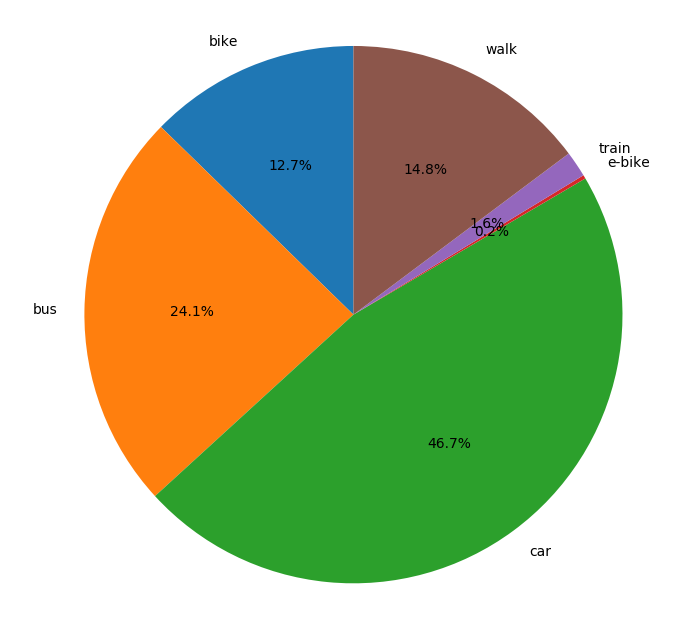

# QROWD TMD

During the Agile Modal Split Computation pilot, we collected trip data as part of the continuous development of the Transport Mode Detector (TMD) component. This is of particular interest for research and practitioners looking to test their own transport mode detection approaches.

The dataset is comprised of 319 accelerelometer time series, each one representing a commute performed by a single transport mode. We captured trips for bike, bus, car, e-bike and train rides as well as walks, which amounts to 213,474 seconds of accelerometer readings. The respective modes are distributed as follows:

- bike:	34,057 seconds
- bus: 	64,709 seconds
- car: 	125,225 seconds
- e-bike:	589 seconds
- train:	4,170 seconds
- walk:	39,625 seconds

